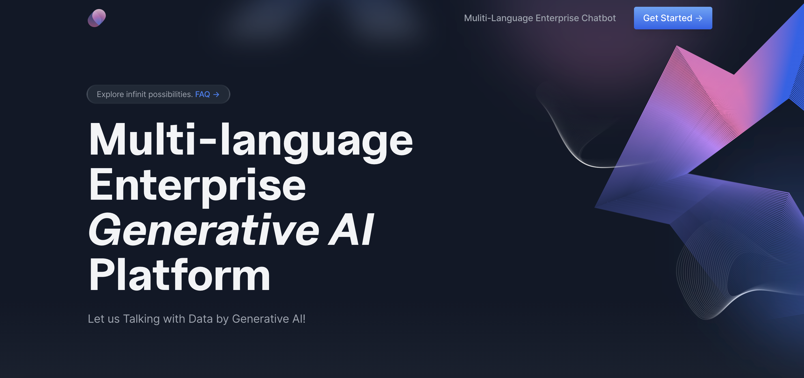
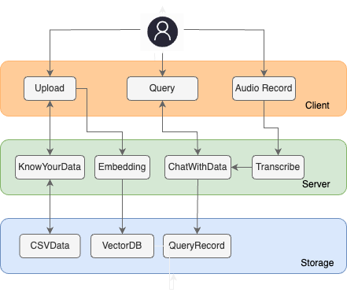

# ODSC-Project--Voice-Interactive-RAG-ChatGPT-Robot

 

 Voice-Interactive-RAG-ChatGPT-Robot with domain knowledge
### 1.Quick Portral
### 
| **--->** [1. Streamlit](https://rayden-xu-multilingual-intelligent-enterprise-ai-welcome-vz5mt8.streamlit.app/Specialist) |

| **--->** [3. Final Project Document](https://docs.google.com/document/d/1Z6KWxwOuMLzaXAaJ5z1QDW636wtJuhWx3TBL0i9yT00/edit#) |

### 2.Architecture

### 3.Backend 

### 4.Tech Stacks
- Python
- Streamlit
- Pinecone
- Openai Text-Davinci-003
- Openai Whisper
- AWS S3
